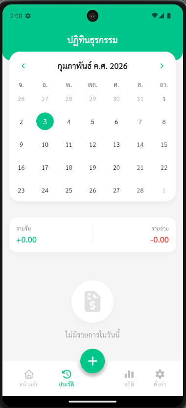
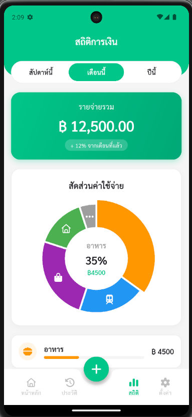
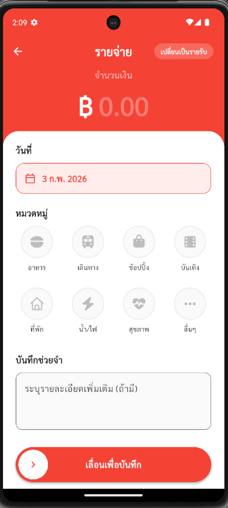
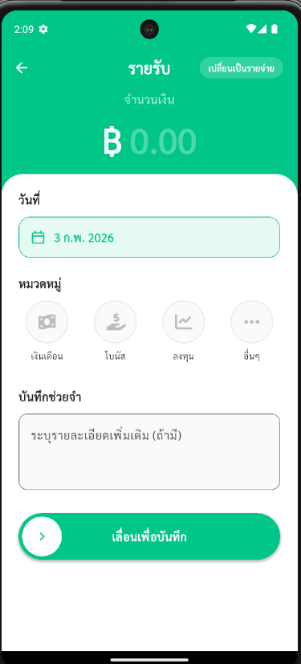

# Expense App (บันทึกรายรับ-รายจ่าย)

แอพพลิเคชันสำหรับบันทึกรายรับ-รายจ่ายประจำวัน พัฒนาด้วย [Flutter](https://flutter.dev/) เน้นการใช้งานที่ง่าย สะอาดตา และรองรับ Dark Mode อย่างสมบูรณ์

## ✨ ฟีเจอร์หลัก (Features)

*   **Dashboard**: ภาพรวมสถานะการเงิน, กราฟแสดงรายจ่ายรายวัน, รายการล่าสุด
*   **บันทึกรายการ (Add Transaction)**: เพิ่มรายรับ/รายจ่าย พร้อมระบุหมวดหมู่และบันทึกช่วยจำ (Note)
*   **E-Slip**: ใบเสร็จบันทึกรายการที่สวยงาม พร้อมแชร์ได้ทันที
*   **ปฏิทินประวัติ (History)**: ดูรายการย้อนหลังในรูปแบบปฏิทินและรายการ
*   **สถิติ (Statistics)**: วิเคราะห์พฤติกรรมการใช้จ่ายด้วยกราฟวงกลม (Pie Chart) แบ่งตามหมวดหมู่
*   **Dark Mode**: รองรับโหมดมืด/สว่าง สลับได้ตามต้องการ พร้อม Animation ที่นุ่มนวล
*   **ภาษาไทย**: รองรับการแสดงผลภาษาไทยเต็มรูปแบบ (ฟอนต์ Sarabun)

## 🛠️ เทคโนโลยีที่ใช้ (Tech Stack)

*   **Framework**: Flutter
*   **Language**: Dart
*   **State Management**: Provider
*   **UI Components**:
    *   `fl_chart`: สำหรับกราฟแท่งและกราฟวงกลม
    *   `font_awesome_flutter`: ไอคอนสวยงาม
    *   `google_fonts`: ฟอนต์ Sarabun
    *   `action_slider`: ปุ่ม Slide-to-confirm
    *   `table_calendar`: ปฏิทินแสดงประวัติ
*   **Local Storage**: `shared_preferences` (สำหรับการตั้งค่าธีม)

## 📸 ภาพตัวอย่าง (Screenshots)

| Dashboard (Light) | Dashboard (Dark) | Stats (Dark) |
|:---:|:---:|:---:|
|  |  |  |

| History | Settings |
|:---:|:---:|
|  |  |

## 🚀 การติดตั้งและเริ่มใช้งาน (Getting Started)

### สิ่งที่ต้องมี (Prerequisites)

*   [Flutter SDK](https://docs.flutter.dev/get-started/install) (เวอร์ชั่นล่าสุด)
*   VS Code หรือ Android Studio

### ขั้นตอนการติดตั้ง (Installation)

1.  Clone โปรเจกต์นี้
    ```bash
    git clone https://github.com/your-username/expense-app.git
    ```
2.  ติดตั้ง Dependencies
    ```bash
    flutter pub get
    ```
3.  รันแอพพลิเคชัน
    ```bash
    flutter run
    ```

## 📂 โครงสร้างโปรเจกต์ (Project Structure)

```
lib/
├── constants/          # ค่าคงที่ต่างๆ เช่น สี (AppColors)
├── providers/          # State Management (ThemeProvider)
├── utils/              # ฟังก์ชันช่วยเหลือต่างๆ
├── widgets/            # Widget ที่ใช้ซ้ำ (Custom Widgets)
├── add_transaction_screen.dart
├── dashboard_tab.dart
├── history_screen.dart
├── home_screen.dart    # หน้าหลักจัดการ Navigation
├── main.dart           # Entry point และ Theme Configuration
├── settings_screen.dart
├── stats_screen.dart
└── transaction_slip_screen.dart
```

## 🎨 การปรับแต่งธีม (Theme Customization)

แอพพลิเคชันใช้ `ThemeProvider` ในการจัดการธีม โดยสามารถปรับแต่งสีหลักได้ที่ไฟล์ `lib/constants/app_colors.dart` และตั้งค่าธีมได้ที่ `lib/main.dart`

---
**Developed with ❤️ using Flutter**
